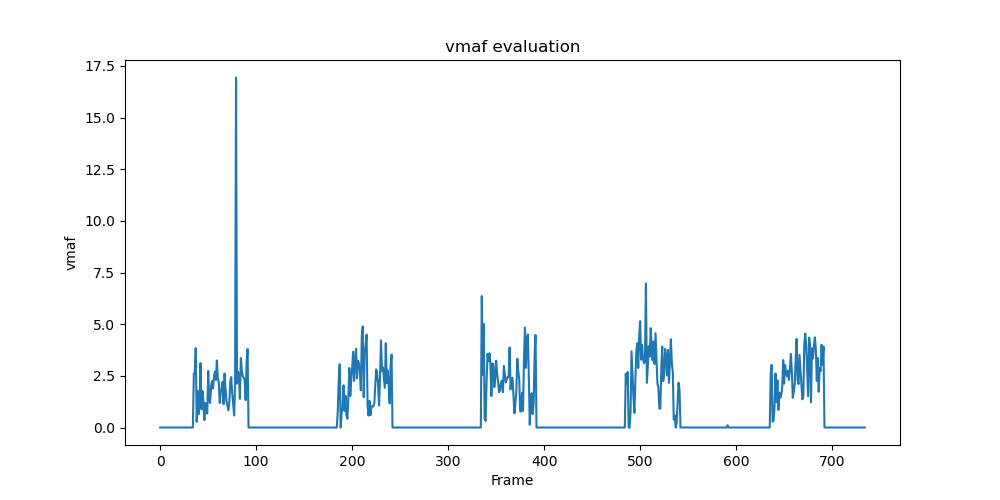

# 计算机网络实验班Lab1实验报告
黄骏齐 张龄心 刘智瀚 何劲范

### 简介
实验环境：在Windows 11操作系统的docker环境下，完成了本机到本机的传输；同时在安装于VMware Workstation 17 Player中的Ubuntu 20.04LTS与Windows本机之间完成了不同IP的传输

处理器13th Gen Intel(R) Core(TM) i5-13500H 2.60GHz

仓库地址 https://github.com/huangjunqi1/WebRTCLab
#### 实验流程
1. AlphaRTC的安装
2. vmaf的安装
3. 视频传输
4. 结果分析

### 环境配置

#### AlphaRTC的安装
使用了docker环境下的官方提供的镜像

```
wget https://github.com/OpenNetLab/AlphaRTC/releases/latest/download/alphartc.tar.gz
docker load -i alphartc.tar.gz
```

奇怪的是，使用`From docker registry`与使用`From github release`两种最终结果会有区别，在生成视频后的log文件有一些差距。我们还是选择了`From github release`，可以能够得到更具体的log文件。

#### vmaf和ffmpeg的安装
事实上，vmaf的安装十分方便，因为官方提供了release。在Windows下，只需要下载其中的exe文件，以及仓库中`model/`下相应的模型即可使用。

ffmpeg则在官网[https://ffmpeg.org/](https://ffmpeg.org/) 中找到对应的版本，直接下载即可

为了方便命令行输入，将两者都加入环境变量的Path中
### 视频传输

我们选用了动画《[Band Dream! It's MyGO!!!!!](https://space.bilibili.com/1459104794?spm_id_from=333.337.0.0)》Ep8 20:49~20:55（共6秒150帧）的片段，并将原视频分别生成1920x1080,640x360,512x288三种质量的yuv进行传输实验。

#### 本机传输

用如下命令将原`xxx.mp4`文件转化为`yyy.yuv`
```
ffmpeg -i xxx.mp4 -s aaxbbb -pix_fmt yuv420p yyy.yuv
```
将生成的`yuv`文件放入`AlphaRTC\examples\peerconnection\serverless\corpus\testmedia\`下

分别修改`receiver_pyinfer.json`和`sender_pyinfer.json`中的`width`,`height`,`fps`,`autoclose`项

执行命令
```
docker run -d --rm -v `pwd`/examples/peerconnection/serverless/corpus:/app -w /app --name alphartc alphartc peerconnection_serverless receiver_pyinfer.json
docker exec alphartc peerconnection_serverless sender_pyinfer.json
```
在Windows下，这里需要使用绝对路径，然后能够得到`outvideo.yuv`和`webrtc.log`以进行下一步分析

#### 不同IP间的传输
在VMware虚拟机中安装Ubuntu20.04LTS，并设置网络连接模式为NAT，传输的视频质量为512x288

实验中使用本机向虚拟机传输视频，使用`ifconfig`观察到虚拟机的IP，然后设置`sender_pyinfer.json`中的`dest_ip`，`receiver_pyinfer.json`中的`listening_ip`仍为`0.0.0.0`，并设置两者`logging`的`enable`均为`true`，这样能够分别得到sender和receiver的log文件。

执行命令，分别启动本机(sender)与虚拟机(receiver)的docker容器
```
docker run --privileged --network=host -d --rm -v `pwd`/examples/peerconnection/serverless/corpus:/app -w /app --name alphartc alphartc /bin/bash -c "while true; do sleep 10000; done"
```

然后在虚拟机执行`docker exec --privileged alphartc peerconnection_serverless receiver_pyinfer.json`，在本机执行`docker exec --privileged alphartc peerconnection_serverless sender_pyinfer.json`，完成后，可以得到`outvideo.yuv`,`webrtc.log`,`webrtc-sender.log`以进行下一步分析。

最后，可以用命令
```
ffmpeg -f rawvideo -s 222x222 -pix_fmt yuv420p -i yyy.yuv xxx.mp4
```
得到`mp4`文件方便人工观看
### 结果分析

#### 肉眼观察
获得传输的视频出现了很明显的横移现象，即视频不仅随着时间轴运动，也会随着x轴运动，我们并不是很清楚这是由什么原因造成的。

此外，还有图层的偏移问题，可以看出还有另一个“图层”在底下流动，比如下图中底下就有一个偏红的部分。此外，整个视频(640x360)还少了几帧，从原先的150帧变成了142帧，而以上问题也可能是视频各部分传输时间不同步造成的


#### loss
在`log`文件中，我们唯一找到的可能与loss有关的项`videoInfo`中的`lossRates`一直都是0.0（即使在不同IP传输时也是如此），这与事实是不符的。而用payloadsize却和原文件大小差了一个数量级。而因为理论上获得的视频和原视频的长度相同都是6秒，所以我们直接使用`接收文件大小/原文件大小`的方式计算loss。

- `1920x1080` loss=6.67%
- `640x360` loss=5.33%
- `512x288` loss=7.33%
- `windows2linux(512x288)` loss=8.0%

这种算法很不科学，但还是能看出不同ip间传输会有更多损失。

事实上，重复对512x288的视频进行本机传输实验，得到的文件大小却是固定的，这似乎是一个稳定的输出。而对不同ip的相同视频得到的文件大小会有变化。

#### throughput

在`videoInfo`中，有`payloadSize`和`arrivalTimeMs`两项可以用来计算throughput，总的throughput如下：

- `1929x1080` throughput=106679B/s
- `640x360` throughput=72339B/s
- `512x288` throughput=93008B/s
- `w2l(512x288)` throughput=91603B/s

可以看到不同IP间传输的throughput应该是小于本机传输的，下面是按时间的图。


#### vmaf分析

因为视频发生了平移，整段视频vmaf似乎没有意义，但是逐帧比较的峰值（对齐的那一帧）仍然是有意义的。为了更好得到vmaf值与时间的关系，我们将512x288的视频重复了5遍得到了30秒750帧的视频进行传输实验

总的vmaf值仅有0.965067，随时间变化图如下


在早期还是有一个接近20的分值，但在后面连10也不能达到了。从感官上就是出现了图层偏移的问题。

### 总结